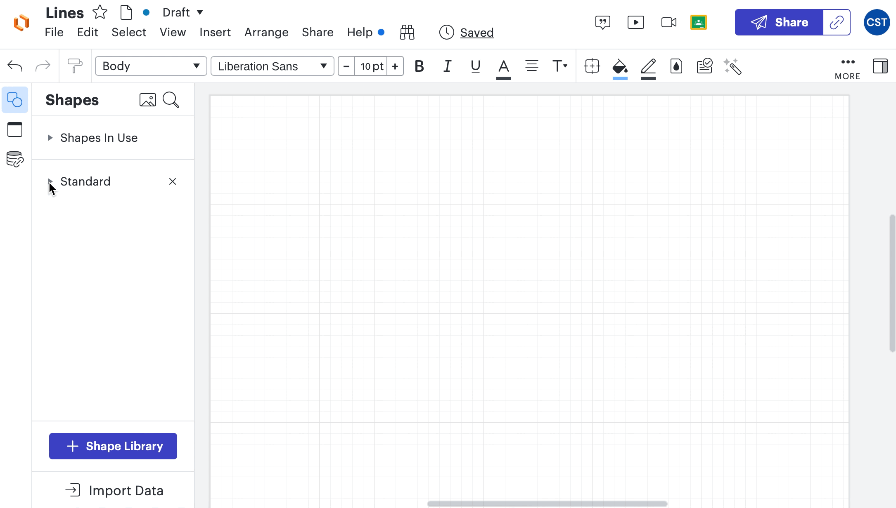
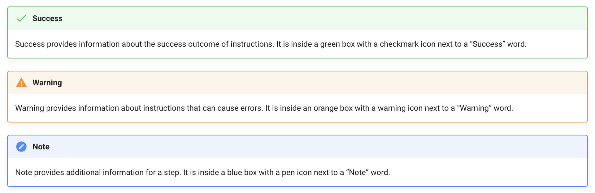

# Overview of Lucidchart Documentation

Welcome! This documentation will guide you with detailed step-by-step instructions on the [Lucidchart](https://www.lucidchart.com/) functions you will need in CST courses.

The goal of this documentation is to help new CST students to get familiar with basic functions in Lucidchart, one of the most frequently used website applications in the CST program. We will also show you some convenient shortcuts you may use while diagramming with Lucidchart.

Here are the topics of this document

* Create a Lucidchart account
* Create, share, and export a Lucidchart document
* Add and format shapes in Lucidchart
* Add and format lines in Lucidchart

## How We Planned and Collaborated

Right after we received the user guide assignment, our team brainstormed the topics we want to cover in the guide and divided the work.

We used Discord as our main online communication tool in addition to in-person meetings while working together on this project.

We also used Git and Github to update our work. We assigned ourselves individual pages to avoid potential push conflicts. After finishing writing the content for all the pages, we used Discord to communicate the changes and coordinate commits.

## How We Created This Guide

This guide was created based on our knowledge of Lucidchart after 2 terms of study in the CST program. We reflected on the problems we frequently encounter while using this application and the useful tips that we found throughout this whole year.

### Using MkDocs

We used [Material for MkDocs](https://squidfunk.github.io/mkdocs-material/) as our MkDoc theme because we like the components provided by it. We customized styles and appearance to make the guide fit Lucidchart’s theme color.

### Using Markdown

The whole guide was written in markdown language with additional plugins to customize fonts and styles.

### Using VS Code

Both of our members use VS Code to write all the markdown files. We were serving our guide with MkDocs through the terminal to see the actual rendering of our guides.

## How We Improved Readability

In order to make this guide easier to read, we decided to present it more visually.
Due to the nature of Lucidchart, it is difficult to describe actions with only words and static pictures, so we decided to add gifs showing instruction steps to make it easier to read.

We also utilized MkDocs' admonitions to highlight important messages relevant to the instructions.

## Conclusion

Writing this document provided us with an excellent opportunity to get a deeper understanding of Lucidchart’s useful functions, and we are excited to share all these useful tips and experiences with you.

Thank you for reading our content, and we hope this user guide can help you improve your experience with Lucidchart.

This document was built on: [Material for MkDocs](https://squidfunk.github.io/mkdocs-material/).
