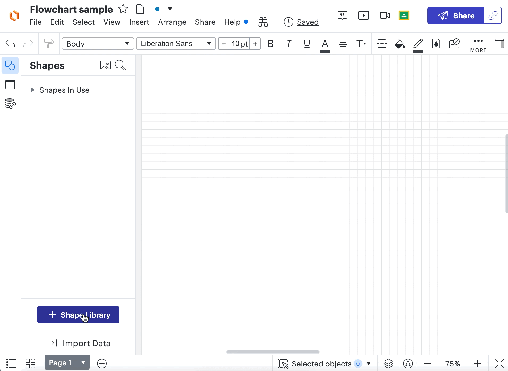
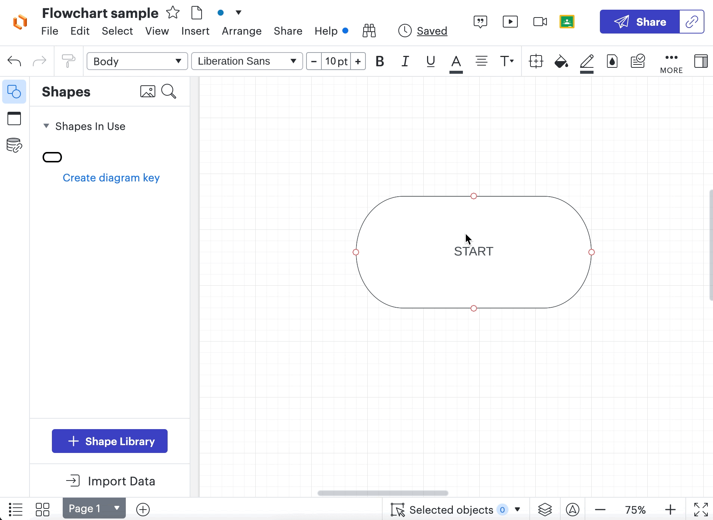
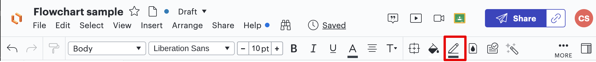
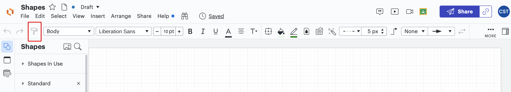
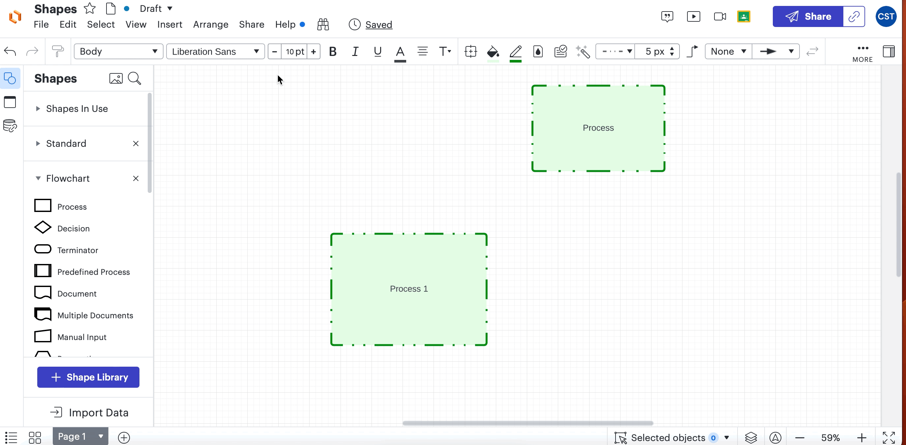

## Overview

Lucidchart provides various tools to create and modify shapes
while creating diagrams from scratch. This guide provides
information on several methods on how to deal with shapes.
Starting from the basics of shapes and providing some advanced tips and tricks.

## Add a shape to your document

1. Choose a shape set by **clicking** the [arrow] on the left
side of the set name.
You will see a list of shapes available for the selected set.

!!!note
    If you can't find the desired shape in the list, you can choose another
    predefined library or create a custom one.

    [Check the 'Add a shape library' section for more details.](#add_shape)

    [Create a custom shape library](#create_shape_library)

2. **Drag** the desired shape from the list and **drop** it onto the canvas.

!!!success
    The shape will appear on the canvas and is ready for further action.

## <a id = "add_shape"> Add a shape library </a>

1. **Click** on the [+ Shape Library] button in the bottom-left corner
of the window or **press** the 'M' key.
You will see the 'Insert content' window.
2. Make sure the [Shape] tab is displayed in bold blue, which means it is selected.
3. **Type** the name of the Shape Library you need in the [Search field] in the upper-left
corner. For example, 'flowchart'.
4. **Check** the [checkbox] next to the sets you want to work with.
5. **Click** the [Use selected shapes] button in the bottom-right corner.

!!!success
    After you close the 'Insert content' window, you can see the selected shape library
    displayed on the Shapes panel.

## Delete shape

1. **Click** on the shape you want to delete. You will see a blue frame around the shape with squares on it.  

2. **Press** the 'Delete' or 'Backspace' key to delete or **right-click** the mouse on the shape and **select** [Delete].

!!!success
    The shape has been deleted.

## Style shape

You can change the fill color of a shape, border thickness, style, or color.

### Fill color

1. **Click** on the shape you want to modify.

2. **Click** the [paint bucket icon] on the formatting toolbar.

3. **Select** the desired color from the menu. Colors are listed in different opacities and filling styles.

### Border style

#### Change line color

1. **Click** on the shape you want to modify.
2. **Click** the [pen icon] on the formatting toolbar.

3. **Select** a border color from the menu.

#### Change line thickness and border type

1. **Click** on the shape you want to modify.
2. Navigate to the [Line Style] pickers on the formatting toolbar.

3. **Select** border type from the options in the dropdown, or **set** border thickness in the picker.

#### Set default style

To change the default style for all shapes in your project:

1. **Click** anywhere on the canvas to unselect any selected shape.
2. Set style settings, such as fill color, line style, etc.

!!!success
    From now on, any new shape you add will be styled according to the set style.

#### Copy style

To apply the same style to all shapes on your canvas:

1. **Click** on the shape that you want to copy the style from.
2. **Click** on the [paint roller brush icon] to copy the style in the formatting toolbar.

3. **Click** on the shape you want to apply the style to.

!!! success
    The copied style is applied to the shape that was clicked last.

## Manage shapes layout

Lucidchart provides great flexibility in managing the layout of the diagram.

### Align

To align shapes:

1. **Select** shapes you want to align by **holding** [Ctrl] while **clicking** on the shapes
or by **dragging** a box around shapes by **pressing** the left mouse button.

    A blue rectangle should be displayed around all selected shapes. Additionally, each shape should be displayed with a blue
    border.

2. **Right-click** the mouse on [selection]

3. **Choose** the [Align] option from the options menu

4. **Select** the alignment option from the list

### Group

To combine several shapes into one object:

1. **Select** shapes you want to group by **holding** [Ctrl] while **clicking** on the shapes
or by **dragging** a box around shapes by **pressing** the left mouse button.
2. **Right-click** the mouse on the selection
3. **Select** the Group option in the menu

[//]: # (NOTE: do we need a gif here? also is "selection" a button that should have []?)

### Lock

To lock a position, size, or style of a shape:

1. **Click** the shapes you want to lock.
2. **Click** the [lock icon] on the formatting toolbar.
3. In the window, **check** the boxes for all characteristics of a shape you want to lock.
4. **Close** the window to save changes

!!! note
    To be able to modify a locked position, size, or style of a shape again,  follow the same steps and click [Unlock].

!!!warning
    If the shape you locked is inside a parent object, such as a container or a group,
    the shape will follow the container/group even if its position is locked.
