## Overview

Lucidchart is an online diagramming and flowchart software that allows users to create and collaborate on professional-looking diagrams. We will be going through how to register an account that has premium functions unlocked, and how to create, share and export a document.

## Register an account

You need to register an account to use Lucidchart. This section will show you how to register a free account with premium functions.

1. **Open** Lucidchart’s homepage, and **click** [Sign up free] on the top right.

    This will lead you to the signup page.

    <figure markdown>
    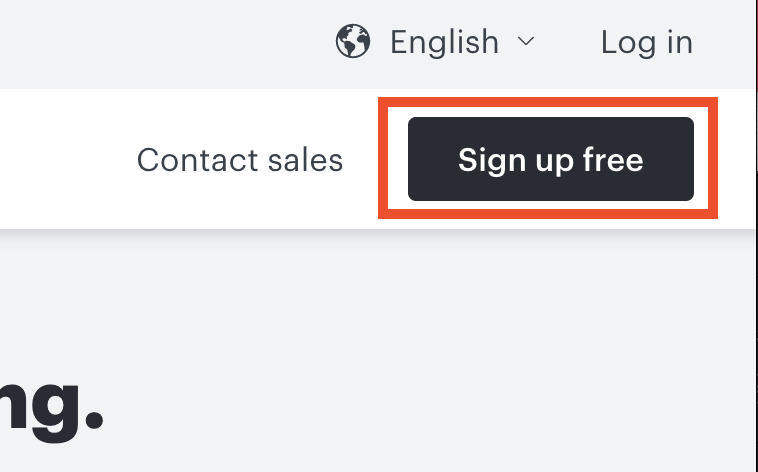{width="400"}
    </figure>

2. **Click** [Start free] which is highlighted in orange.

    Even though the description mentioned there are a limited number of documents, shapes, and templates you can use for this option, this restriction will be weaved in the following step.

3. Make sure the [Sign up free] tab is selected.

    **Enter** the username, email, and password that you want to register with.

    In order to get unlimited uses of shapes and documents for free, you must register with your myBCIT email.

    Once you have entered all the required information correctly, **click** [Create account].

!!!warning
    You must use myBCIT email address to register in order to get unlimited uses of shapes and documents, otherwise you will have limited numbers of shapes and documents you can work with.

<figure markdown>
  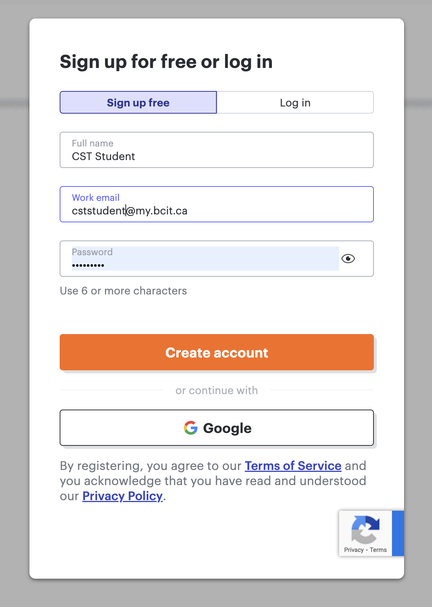{width="500"}
</figure>

!!!success
    Congratulations! You have successfully created a Lucidchart account.

## Create a Document

Lucidchart provides various types of documents such as whiteboards, diagrams, mind maps, etc. In the CST program, we will only need to use the diagram option.

1. After you create your account, you will see a question page to set up your recommended templates.

    **Click** [Students] → [Higher Education] → [Start diagramming].

    Recommended templates will be generated.

2. **Click** [Start diagramming] in the pop-up window.

    This will bring you to a blank diagram.
    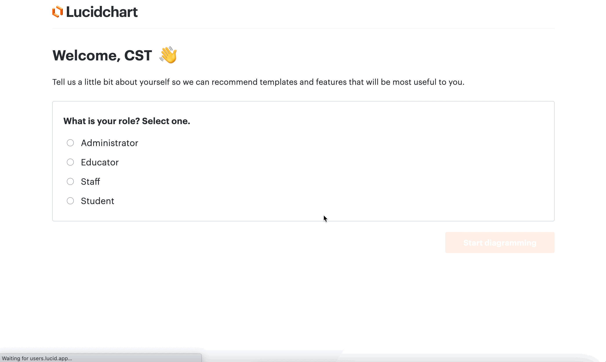

    !!!success
        You have now successfully created a blank diagram.

3. To rename your diagram, **click** on [Blank diagram] at the top left, **enter** the new name for your document, and press **return**.

!!!note
    You can see there is a clock symbol with the text “Saved” next to the menu bar indicating your new diagram name is successfully saved.

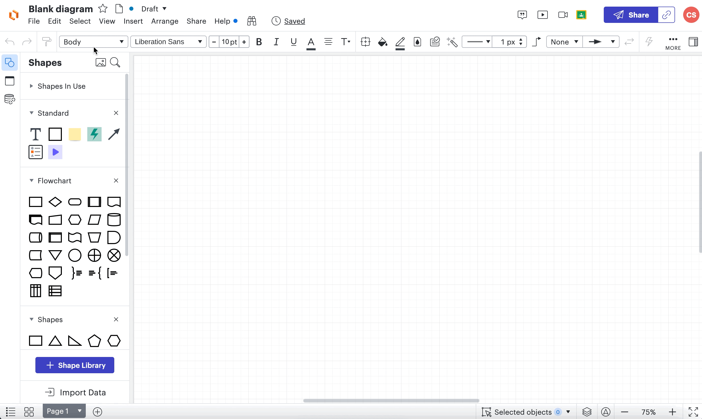

!!!note
    To create a new diagram in the future, **click** [+ New], and **click** [Lucidchart] → [Blank Document] in the dropdown menu on your Lucidchart homepage.

    <figure markdown>
        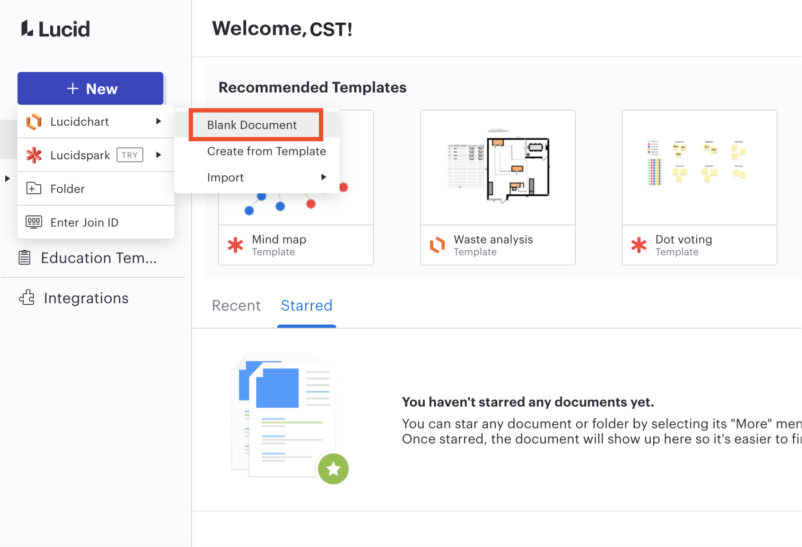{width="800"}
    </figure>

## Share a Document

Lucidchart allows you to share documents with your classmates, so you can work on the same document at the same time.

1. To share the document with others, **open** your document and **click** [Share] on the top right.

    <figure markdown>
    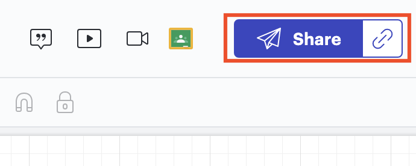{width="500"}
    </figure>

2. There are three ways to share your document. We will introduce the two common options.

### Option 1: Sharing via email

1. **Enter** the email address or Lucid group that you want to share your document with in the text box, press **return**, and the email address will appear as a gray label inside the box.

2. You can **remove** an email address by **clicking** the [x] on the side.

3. After you add all the email addresses you want, **click** [Invite].

<figure markdown>
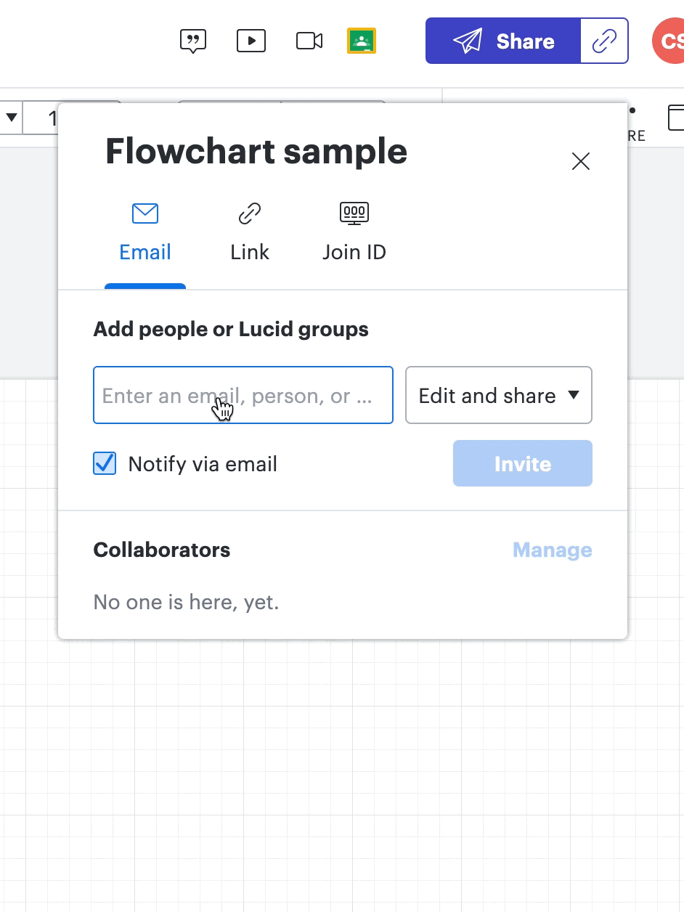{width="500"}
</figure>

### Option 2: Sharing via a shareable link

1. **Click** on the [Link] tab.

2. The shareable link is disabled by default, so you need to **click** on [Off] to enable it, and then **click** [Copy link].

<figure markdown>
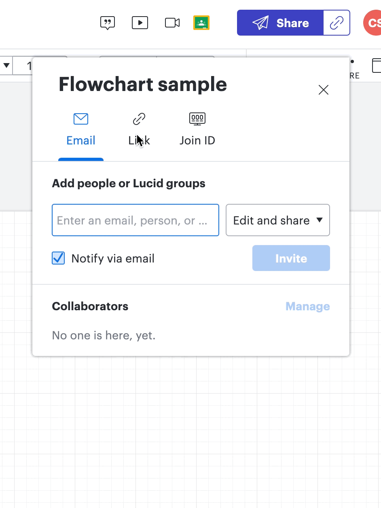{width="500"}
</figure>

!!!success
    You now have the link address in your clipboard, and you can share your link with people or your group.

### Permissions

You can set users' permission of the document you share and individual user's permission.

1. To set permissions for other users on this document, **click** on [Edit and share], and **choose** the desired permission option from the dropdown menu when sharing the document.

    Details of each option are written inside.

    <figure markdown>
    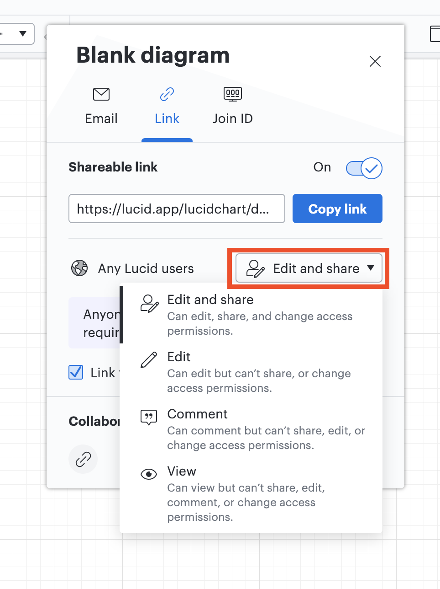{width="500"}
    </figure>

2. You can change other users' permission by **clicking** [Manage] and **selecting** the permission option from the dropdown menu next to the user’s email.

3. When you are finished, **click** [Done].

4. The changes will be saved.

    <figure markdown>
    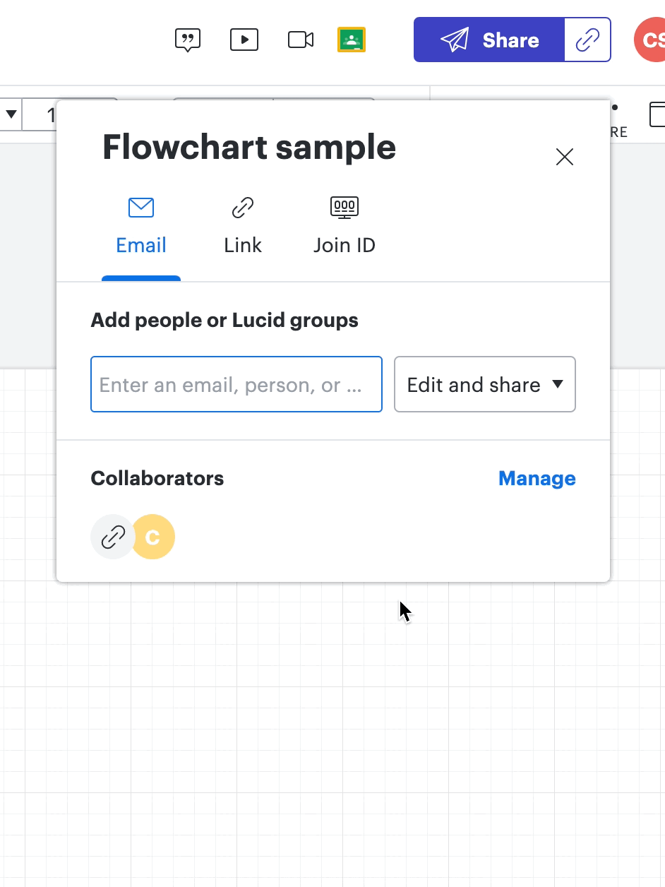{width="500"}
    </figure>

## Export a document

1. To export a document, **click** [File] → [Export], and **select** the format you want to save the document in.

    <figure markdown>
    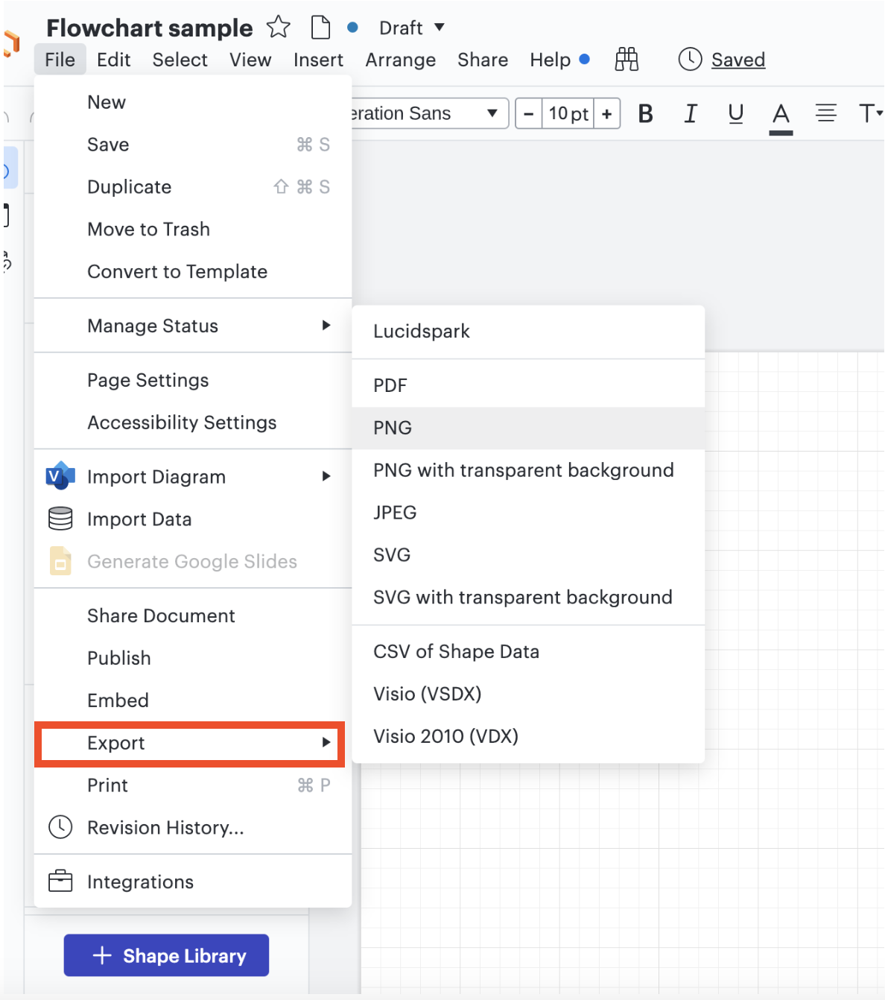{width="600"}
    </figure>

2. The [Options] on the right side allows you to customize the exported document.

    a. To change file format, **click** the dropdown menu under [File Format] and **select** the format you want.

    b. To change how the diagram will be cropped, **click** the dropdown menu under [Crop] and **select** crop options.

    c. To change the quality of the exported diagram, **click** the dropdown menu under [Quality] and **select** quality options.
    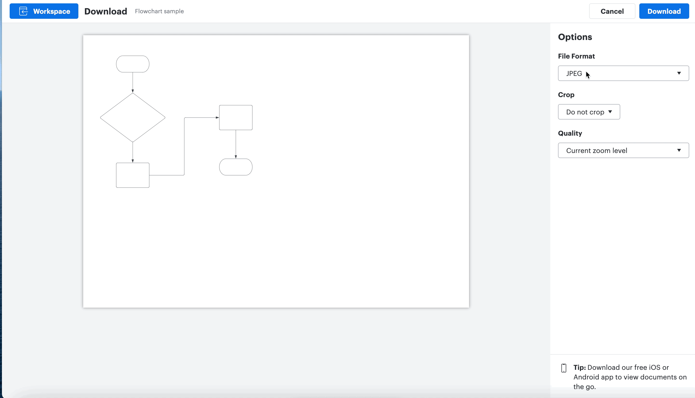

3. **Click** [Download] on the top right, and the file will be downloaded into your default download folder.

<figure markdown>
  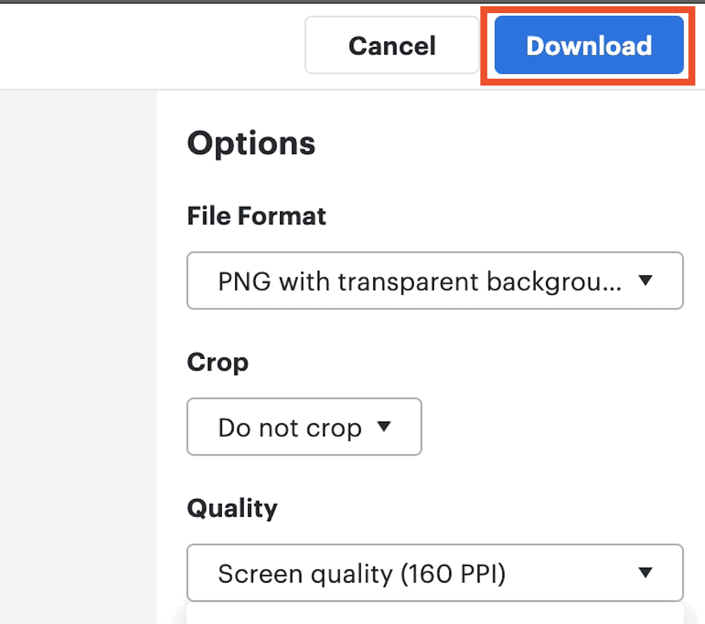{width="400"}
</figure>

!!!success
    Congratulations! You have successfully exported a Lucidchart document and downloaded it onto your computer.
